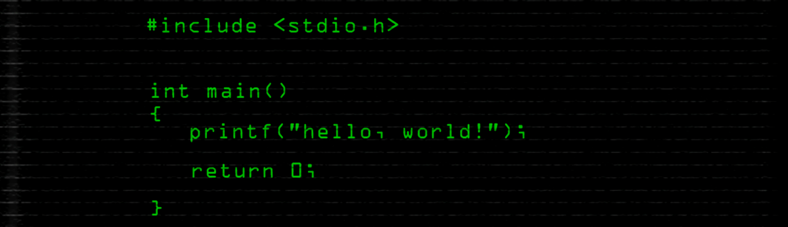

### Who Am I !? 👀 

---

- 👋 Hi, I’m Vishnu
- 📚 Geeky boy interested in writing programs/codes/scripts. What type !? Doesn't really matter as long it keeps me awake all night.
- 🌱 I’m currently learning computer science.
- 💞️ Though I am open to all languages and frameworks, I am particularly interested in collaborating with projects in the field of ML and Data science.
- 📞 Reach me at 

  - **Mail : vishnudinesh2011@gmail.com**
  - 

---

### 🛠 Languages, Tools,Frameworks...I am currently using:

---

 ---
 
 

<!---
kv-95/kv-95 is a ✨ special ✨ repository because its `README.md` (this file) appears on your GitHub profile.
You can click the Preview link to take a look at your changes.
--->
